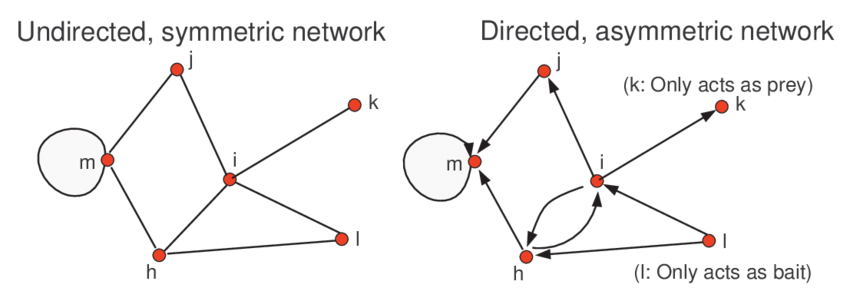
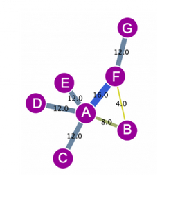
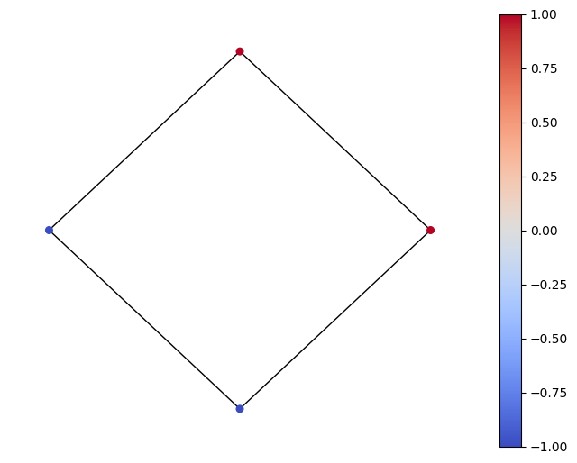
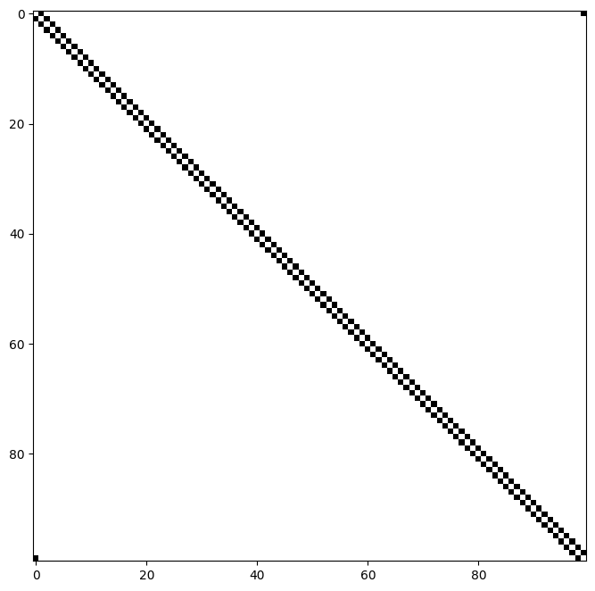
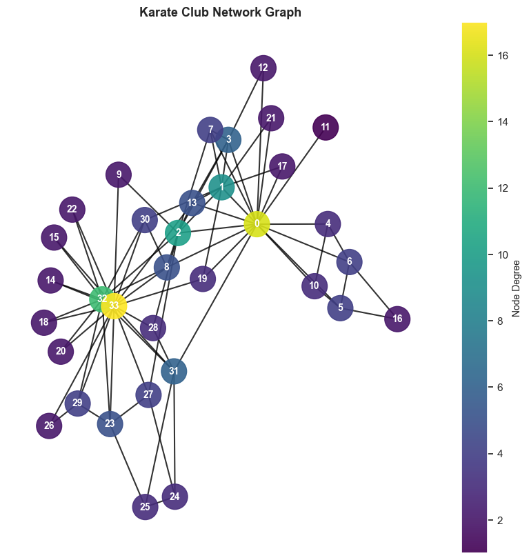
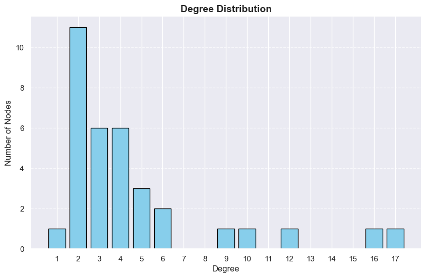
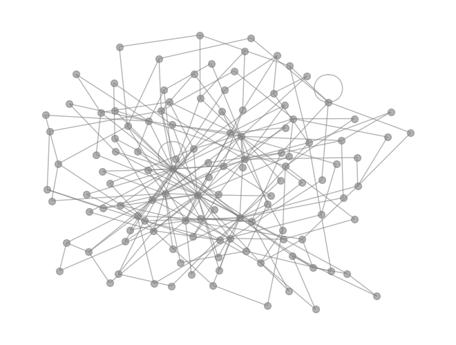
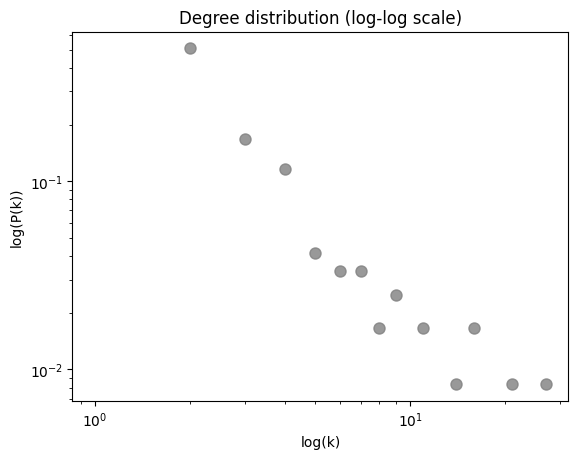
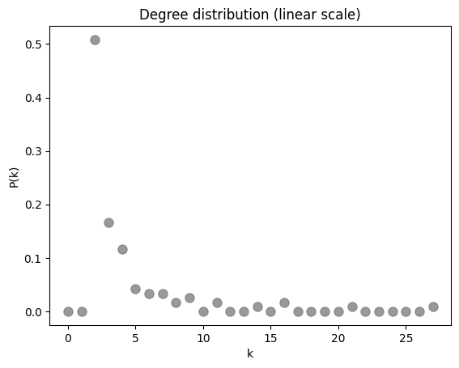

This is a term paper submission on the fourth module on Complex networks. I have written below about the things I found remarkable in its applications.

# What are Networks?

'A complex network is a graph with non-trivial topological features that do not occur in simple networks' (wiki). A network/graph is a collection of connected objects that can be nodes (eg. enzymes) or edges (eg. interations). They are ubiquitous in the real world, appearing in various domains such as biology, physics, sociology, and computer science. Understanding the properties and dynamics of these networks is crucial for addressing a wide range of challenges, from predicting the spread of diseases to optimizing communication networks.

Some examples include the world wide web with pages as the nodes of the network and the links as the edges, social interactions or friends as edges and nodes, networks of publications, citations, transportation networks, metabolic networks.

These graphs are completely defined by the set of nodes and edges $G = {n_i, m_{i \to j}}$

# Types

## Undirected networks

In an undirected network, the connections between nodes are bidirectional. This means that if node 1 is connected to node 2, then node 2 is also connected to node 1. The relationship is symmetrical.

Some examples include social networks friendships, transportation networks like road networks, where you can travel from point A to point B and vice versa and molecular networks like protein-protein interaction networks, where proteins can interact with each other in both directions.

## Directed networks

In a directed network, the connections between nodes have a specific direction. This means that if node A is connected to node B, it doesn't necessarily imply that node B is connected to node A. The relationship is asymmetrical. Some examples for this are website link structures like world wide web hyperlinks, citations of publications, food webs

    
    
<em>Directed and undirected networks</em>

## Weighted Networks

Now it is clearly seen that not all nodes and edges can be equal, such as in metabolic networks, we see that different enzymes have different behaviors and different interations and some may have many more functions than the others leading to a probabalistic weight on the possibility which leads to different types of nodes.

The weights represent the strength, importance, or capacity of the connection. This additional layer of information allows for a more nuanced understanding of the relationships between nodes. Some commonly used weighting systems are binary weights, real-values weights, discrete weights.

    
    
<em>Weighted</em>

# Recall: Adjacency matrix

Let us take a simple example with 4 nodes, and consider that the coupling of $x_n$ is between $x_{n+1}$ and $x_{n-1}$. Now for this matrix, we can easily say that it will have atleast two components in a row. So, we define A as 

$$A_{i,j} = 1, \text{if j = i - 1 or j = i + 1}$$

and 

$$A_{ij} = 0, \text{otherwise}$$ 

So in our 4 x 4 matrix for the above example we get

$$\begin{pmatrix}
0 & 1 &0&1\\
1&0&1&0 \\
0&1&0&1 \\
1&0&1&0
\end{pmatrix}$$

And the network looks like this

    

and the matrix can be represented like this

    

# Degree distribution of a network

Number of connections to a node. In undirected networks it is given by 

$$k_i = \sum_j a_{ij}$$ 

where the sum is over all nodes in the network. But if we have a directed network then number of connections coming out of a node is given by 

$$k_i = \sum_j a_{ji}$$

and sum of both of these gives the total degree of a directed network.

# Mean Path Length

The average of the shortest path length, averaged over all pairs of nodes. For an undirected graph of N nodes it is given by 

$$\lambda = \frac{\sum_{i \neq j}d(i,j)}{N(N-1)}$$

where $d(i,j)$ is the shortest path betweeen i and j in the geodesic. We see that if two nodes are disconnected, then the path length between them in infinite. If there are any disconnected paths then the length $\lambda$ diverges. So to avoid this we calculated $\lambda$ only from nodes in the largest connected component.

# Real world social networks

I have implemented code for Zachary's karate club which I found on wikipedia. It is just a date set which is of a social network. described in the paper "An Information Flow Model for Conflict and Fission in Small Groups" by Wayne W. Zachary. 

Zachary studied a karate club for a period of three years. It captures 34 members of it (there are other 77, 78, 33 membered sets as well) and the links between them depending on who interacted outside the club. A conflict between administrator "John A" and instructor "Mr. Hi" split the club into two. Half the members joined Mr. Hi's new club, while the rest either found a new instructor or quit karate. Zachary correctly assigned all but one member to their new group.

## Results
The plot shows the network created and the distribution of degree. The color corresponding to the degree in the plot itself.

    
    
<em>network graph of social relationships among the 78 individuals in the karate club studied by Zachary</em>

    

# Barabási Albert Model

The random network model assumes a fixed number of nodes (Erdős-Rényi model). So it fails to reproduce many hubs and the power law observed in maybe real wolrd examples. In a real network the number of nodes continually grows because of the addition of new nodes.

The ubiquity of the scale-free property tells us about growth (addition of nodes) and prefferential attachment. The Barabási Albert Model shows us this growth and preferential attachement. Some examples are something like social media, if one opens a linkedin account it is an isolated node that is created and then one follows other people, friends, their friends and this increases making mutual freinds and that creates the edges.

## The model

1. Start with a small network
2. Place a new node
3. Draw a fixed number of links to the node from the existing nodes with the probability of linking to a node proportional the degree of that node.
4. Loop

    

The degree of distribution follows a power law

$$p_k = \frac{2m(m+1)}{k(k+1)(k+2)}~k^{-3}$$

Which is a **Scale Free Model** and the expected degree of a given node grows as the square root of time and is consistent with first mover's advantage 

$$k_i(t) = m \left(\frac{t}{t_i}\right)^\beta, \beta = 1/2$$

The BA model does capture the intuition that real networks grow and prefere highly connected nodes and predicts the scale-free behavious observed in the real networks. The preference is proportinal to the number of links and the earliest nodes are most connected.

## Result

For the parameters set to

n_0 (the initial number of nodes) = 2
n (the final number of nodes) = 120
m (the value of m parameter (m<=n_0))= 2

we have

    

    

    

# An important application

There is not a very defined scale for measuring succes in art. It could be how passionate you are towards it, or how many paintings you have sold, how many exhibitions has your art been in, how many people know you, how many people could recognize you. But mostly, it is external recognition, which gallery you exhibit in, who is interested in your work and how much are they willing to pay and if your work has been in any auctions. Coming from a family of artist, this is what intrigued me in the applications of the model. What I have seen is they have only one focus which is to really express their talent, to paint, and are just extremely passionate about it.

The ideal dependencies considered are (in the contemporary art context) the value of an artwork is determined by very complex networks.

Who is the artist?
Where that artist had exhibited before?
Where was that work exhibited before?
Who owns it, and who owned it before?

Using the Barabási Albert Model we can model this, put an artist, take the first couple exhibits and make a map and if I see the dynamics over the next 10 years, I would be able to predict their success, where their works can go next, giving accurate predictions. So if one comes from a not a well known institution, their success would be determined by if they followed a non-traditional path. Sticking to just one gallery would not really expose them to many nodes that are better. But if they spread their networks all across, they have  ahigher chance of hitting the right node leading to a succesful career. As it is said 'Rich becomes richer' (a followed implementation of the same is also in the code with very interesting results)

# References

For networkx: https://networkx.org/documentation/stable/reference/classes/index.html

[1] https://www.researchgate.net/figure/Shown-on-the-figure-is-an-example-of-a-network-presented-as-an-undirected-network-left_fig13_242547811

[2] https://www.ebi.ac.uk/training/online/courses/network-analysis-of-protein-interaction-data-an-introduction/introduction-to-graph-theory/graph-theory-graph-types-and-edge-properties/

[3] https://in.mathworks.com/help/matlab/math/directed-and-undirected-graphs.html

[4] https://en.wikipedia.org/wiki/Weighted_network

[5] https://networksciencebook.com/chapter/5#introduction5

[6] https://en.wikipedia.org/wiki/Zachary%27s_karate_club#cite_note-Data77-4

[7] "An Information Flow Model for Conflict and Fission in Small Groups" by Wayne W. Zachary. 
